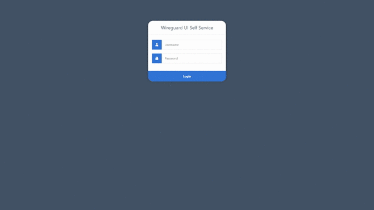

# wgui-front
A front end for WireGuard UI that uses SQLite based back end to enable it to run off of a Raspberry PI.
Note that this front  end requires the [forked wg-ui](https://github.com/cottley/wg-ui "Forked wg-ui") application to work .

## Features

 * Self-serve and web based
 * Manage users and logins via simple web interface
 * Impersonation feature to allow admins to manage user WireGuard interface devices
 * Runs off of any PHP enabled webserver - Tested with Apache and Lighttpd 

## Demo

## Installing

 * Copy the files to the /var/www/html directory.
 * Ensure that the logs subdirectory is writeable by the web server user.
 * Modify the wguiauth.path.to.sqlite.db setting in the config.php  file to point to the path for the sqlite database file that is writable by the web server user.
 * Modify the wguiauth.wgui.url setting in the config.php file to be the reverse proxy path on the webserver for the WireGuard-UI service.
 * Upon first run, login as admin/admin and change the password using the profile page for the admin user.

